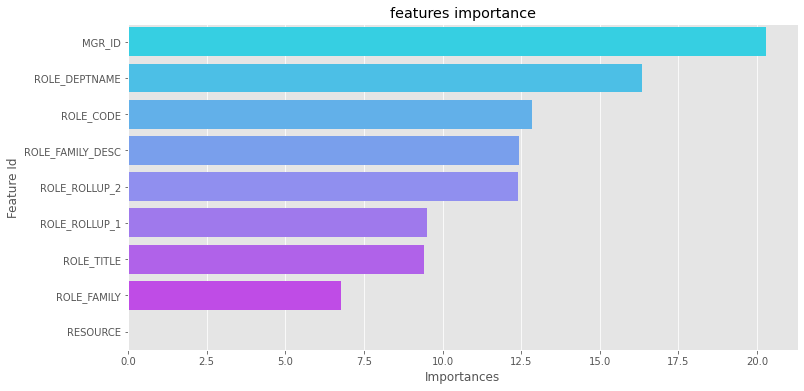

## **Objective: Demonstrate Gradient Boost Methods With Proper Results And Visualizations**

* ### **Showcase GBM Classifier Techniques**
  * RandomForest Classifier
  * Decision Tree Classifier
  * AdaBoost Classifier
  * XGBoost Classifier 
  * LightGBM Classifier 
  * Catboost Classifier 

* ### **Showcase GBM Regression Techniques**
  * XGBoostRegressor
  * CatboostRegressor
  * LightGBMRegressor
* ### **Showcase GBM Ranking Techniques**
  * XGBoost Ranking
  * Catboost Ranking
  * LightGBM Ranking

 

#### **CatBoostClassifier Feature Importance**

 
#### **Plot XGBRegressor Predictions**

 
#### **CatBoostRegressor Feature Importance**

 
#### **Plot XGBoost Ranking**

 
#### **Plot CatBoost Ranking**

 
#### **Plot LightGBMBoost Ranking**
